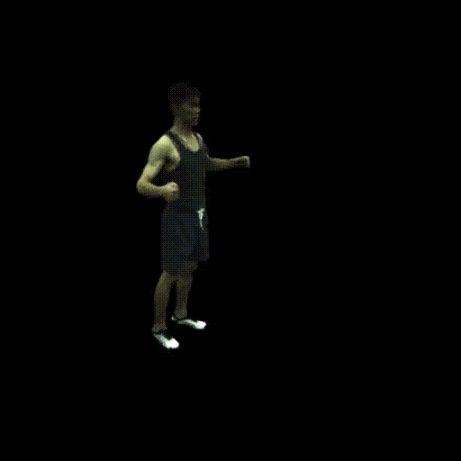

# SMPL-sampled Gaussian Splatting



A from-scratch, readable PyTorch implementation of an **animatable human avatar**: 3D
Gaussians are sampled on the SMPL body mesh, fitted as surface-hugging disks, articulated
with the skeleton (LBS) plus a non-rigid MLP, coloured with view+pose-dependent shading,
and trained against multi-view images with adaptive densification. A simplified, transparent
take on *3DGS-Avatar* (Zheng et al., CVPR 2024).

**Read [`WRITEUP.md`](WRITEUP.md) first** — it derives every equation (representation,
surface sampling, LBS, EWA splatting + compositing, the rasterizer gradients, SH + pose
colour, losses, and adaptive density control) and the full pipeline.

## Implementation
- Gaussians sampled on the SMPL surface (vertices + area-weighted barycentric face samples),
  initialised as flat tangent disks with neighbour-spaced anisotropic scale.
- From-scratch SMPL bone transforms `A_b(θ,β)` (we re-derive `batch_rigid_transform`).
- Motion = non-rigid deformation MLP (zero-init) → LBS blend → ZJU `Rh/Th` world placement.
- **View + pose dependent colour**: per-Gaussian SH (degree 3) + a zero-init pose-conditioned
  RGB-offset MLP.
- **Adaptive density control**: clone / split / prune by view-space gradient & scale, with
  periodic opacity reset and the Adam-state surgery that keeps the optimiser in sync.
- A **hand-written, pure-PyTorch differentiable tiled rasterizer** (autograd backprop) —
  see "Why no CUDA rasterizer" below.
- Losses: L1 + windowed D-SSIM + silhouette/mask.

## Setup
```bash
pip install torch numpy pillow imageio imageio-ffmpeg smplx trimesh
```
Then supply the data (not included):

1. **SMPL model** → set `Config.smpl_model_path`. A `.npz` is preferred (e.g.
   `SMPL_NEUTRAL.npz` from the smplx model zoo); `.pkl` works if `chumpy` is installed. We
   read `v_template, shapedirs, J_regressor, weights, kintree_table, f` directly.
2. **ZJU-MoCap** subject folder → set `Config.data_root`. Expected layout:
   ```
   <subject>/annots.npy          # {'cams':{K,R,T,D}, 'ims':[frame]['ims'][cam]}
   <subject>/images/<cam>/<frame>.jpg
   <subject>/mask/<cam>/<frame>.png   (or mask_cihp/)
   <subject>/new_params/<frame>.npy   # poses(72),shapes(10),Rh(3),Th(3)  (or params/)
   ```

Everything is configured in [`config.py`](config.py) (paths, resolution, `n_gaussians`,
LRs, densification schedule, feature flags).

## Run
```bash
# validate the from-scratch SMPL LBS against smplx (needs an SMPL model file)
python human.py validate

# train  (edit config.py first)
python human.py train

# render a moving human from a checkpoint
python demo.py --checkpoint /bigdata/users/aaronzw/gsdata/checkpoints/ckpt_010000.pt --frames all
```

## File Descriptions
| file | role |
|---|---|
| `config.py` | one `Config` dataclass: all paths / knobs / flags |
| `smpl_model.py` | SMPL buffers + from-scratch `bone_transforms` (A_b) + Rodrigues; smplx validation gate |
| `sampling.py` | sample Gaussians on the rest mesh; TBN→quat; kNN scale; init SH/opacity/skin |
| `gaussian_model.py` | optimisable Gaussians (SH params, pose latent) + densify/prune + Adam-state surgery |
| `sh.py` / `geometry.py` | spherical-harmonics eval; quaternion↔matrix helpers |
| `camera.py` | pinhole camera (off-centre principal point supported) |
| `rasterizer.py` | **differentiable tiled EWA splatting** (pure PyTorch, binned) |
| `deform.py` | non-rigid MLP + pose-colour MLP + LBS articulation + SH colour |
| `dataset_zju.py` | ZJU-MoCap parsing, image/mask loading, train/demo split |
| `losses.py` | L1, windowed D-SSIM, mask loss |
| `train.py` / `demo.py` / `human.py` | training loop (with densification) / video render / CLI |
| `tests/test_synthetic.py` | LBS / gradcheck / SH / densify / GPU forward-backward / train-loop |
